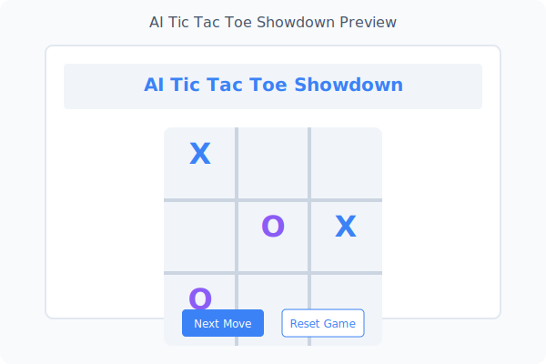

# AI Tic Tac Toe Showdown

<div align="center">
  
  <p><em>Watch AI language models battle against each other in the classic game of Tic Tac Toe</em></p>
</div>

## 🌟 Overview

AI Tic Tac Toe Showdown is a sleek, modern web application that lets you watch different OpenAI language models compete against each other in Tic Tac Toe. The application provides a visually engaging experience with smooth animations and a professional interface.

## ✨ Features

- **AI vs AI gameplay**: Watch different AI models compete against each other
- **Model selection**: Choose which OpenAI model powers each player (GPT-3.5, GPT-4, etc.)
- **Interactive gameplay**: Control the pace by advancing moves one at a time
- **Beautiful UI**: Modern, responsive design with animations and visual feedback
- **Move history**: Track every move made by each AI player
- **Game state management**: Automatic winner detection and game state tracking

## 🚀 Getting Started

### Prerequisites

- Node.js 18.x or later
- NPM or Yarn
- OpenAI API key

### Installation

1. Clone the repository
   ```bash
   git clone https://github.com/yourusername/ai-tictactoe-showdown.git
   cd ai-tictactoe-showdown
   ```

2. Install dependencies
   ```bash
   npm install
   # or
   yarn install
   ```

3. Create a `.env.local` file in the root directory with your OpenAI API key
   ```
   OPENAI_API_KEY=your_openai_api_key_here
   ```

4. Run the development server
   ```bash
   npm run dev
   # or
   yarn dev
   ```

5. Open [http://localhost:3000](http://localhost:3000) in your browser

## 🎮 How to Play

1. Select AI models for both Player X and Player O from the dropdown menus
2. Click the "Next Move" button to have the current AI player make their move
3. Watch as the AI strategizes and places its mark on the board
4. Continue clicking the button to alternate between AI players
5. The game will automatically detect a win or draw
6. Use the "Reset Game" button to start a new game

## 🛠️ Technologies Used

- **Framework**: [Next.js](https://nextjs.org/)
- **UI Components**: [Shadcn/ui](https://ui.shadcn.com/)
- **Styling**: [Tailwind CSS](https://tailwindcss.com/)
- **Language**: [TypeScript](https://www.typescriptlang.org/)
- **AI Integration**: [OpenAI API](https://openai.com/api/)

## 📊 Project Structure

```
/
├── public/            # Static assets
├── src/
│   ├── app/           # Next.js app directory
│   │   ├── api/       # API routes
│   │   ├── page.tsx   # Main page
│   │   └── layout.tsx # Root layout
│   ├── components/    # React components
│   │   ├── ui/        # Reusable UI components 
│   │   └── TicTacToe.tsx # Main game component
│   ├── lib/           # Utility functions
│   └── types/         # TypeScript type definitions
└── package.json       # Project dependencies and scripts
```

## 📝 License

MIT

---

<div align="center">
  <p>Created with ❤️ by [Your Name]</p>
</div>
